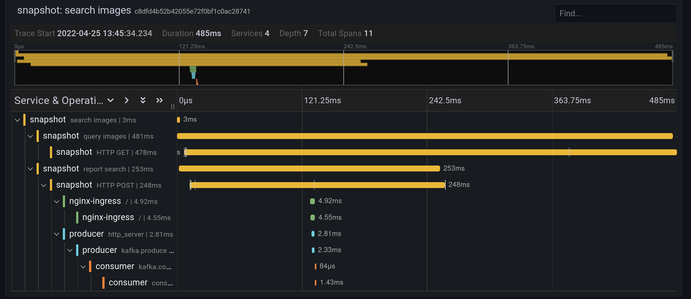

# OpenTelemetry Frontend to Backend Demo
This repo contains the example used for the `Vienna DevOps & Security` meetups.

The meetup series is build around a full example of a frontend, backend composed out of a Ingress controller, Kafka and 
the corresponding consumer and producer

## Meetups
### OpenTelemetry: from frontend to backend
Slides: https://docs.google.com/presentation/d/1jPDH8Csv-Qle7Z-P7rFJgjOsBpgKeehPhjFPqTRET1Y/edit?usp=sharing

### OpenTelemetry: How to debug user performance in your frontend
Slides: https://docs.google.com/presentation/d/1w1VhfGQPgCAPoT2VSB6KZlXZOXa_m5p8R-xzOzzL3hM/edit?usp=sharing

## Usage
Requirements:
- [Kind](https://github.com/kubernetes-sigs/kind/issues) ( node-image >1.16.x )
- [Helmsman](https://github.com/Praqma/helmsman)
- Docker / Buildah ( with Docker alias )

This demo deploys ingresses for `*.testing.com`.   
To make it work you have to rewrite the DNS answers to localhost.

For Linux it has been as simple as adding this line to your network manager ( tested with Arch/Gnome )     
`echo "address=/testing.com/127.0.0.1" > /etc/NetworkManager/dnsmasq.d/testDomains.conf`

To completly create the setup run `make full-setup`

### Create Cluster
To create a kind cluster and add the kubecontext to your config run `make create-kind-cluster`     

In case you need to create the kind cluster using root permissions execute instead `sudo -E make create-kind-cluster`

### Prepare App images
Build and upload the resulting images to your kind cluster 
`sudo make prepare-apps`

### Setup the environment
`make prepare-environment` will setup all applications in your cluster

